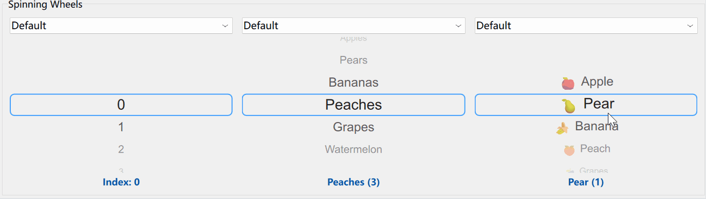
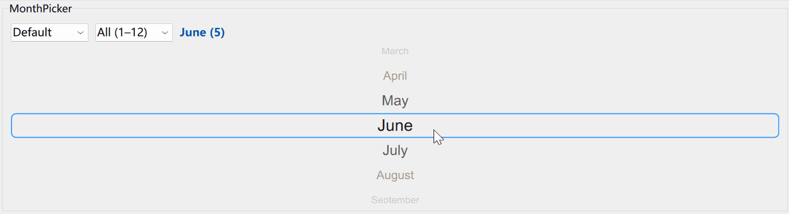
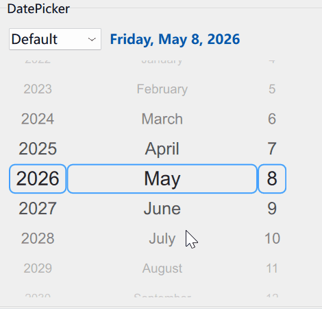

# QML Date Picker Demo

A demonstration project showcasing a mobile-style date picker component in QML with scrollable year, month, and day selectors, built on the flexible SpinningWheel component.

Please look at the [blog post](https://alouettesu.github.io/gai/date-picker/qml/2026/07/01/QML-Date-Picker.html) about this component.

## Overview

This project implements a reusable date picker component (`DatePicker`) with individual picker components for year, month, and day selection. All components are built on the foundation of the `SpinningWheel` - a highly customizable spinning wheel component that supports custom delegates, backgrounds, and highlights. The component features smooth scrolling interactions similar to those found on mobile platforms (iOS, Android).

## Features

- **SpinningWheel Component**: Flexible base component for creating scrollable selectors with full customization support
- **DatePicker Component**: Main date picker with year, month, and day selection
- **YearPicker**: Scrollable year selector with configurable range
- **MonthPicker**: Scrollable month selector with range constraints
- **DayPicker**: Scrollable day selector with automatic adjustment for month length
- **Customization**: Support for custom delegates, backgrounds, and highlight components
- **Locale Support**: Respects system locale for month names
- **Date Range Validation**: Ensures selected dates fall within specified ranges
- **Smooth Animations**: Fluid scrolling and selection animations

## Demo Screenshots

### SpinningWheel Component


### MonthPicker Component


### DatePicker Component


## Project Structure

```
DatePickerDemo/
├── qml/
│   └── main.qml              # Demo application UI
├── src/
│   └── main.cpp              # Application entry point
├── imports/
│   └── Gai/
│       ├── SpinningWheel.qml # Base spinning wheel component
│       ├── DatePicker.qml    # Main date picker component
│       ├── YearPicker.qml    # Year selection component
│       ├── MonthPicker.qml   # Month selection component
│       ├── DayPicker.qml     # Day selection component
│       ├── qmldir            # QML module definition
│       └── CMakeLists.txt    # Build configuration
├── Images/
│   ├── SpinningWheel.gif     # SpinningWheel demo animation
│   ├── MonthPicker.gif       # MonthPicker demo animation
│   └── DatePicker.gif        # DatePicker demo animation
├── CMakeLists.txt            # Project build configuration
├── DatePickerDemo.qmlproject # Qt Creator project file
├── qtquickcontrols2.conf     # Qt Quick Controls configuration
└── resources.qrc             # Resource file
```

## Requirements

- Qt 6.x (Core, Gui, Quick, Qml modules)
- CMake 3.16 or higher
- C++17 compatible compiler

## Building

### Option 1: Preview using Qt Designer Studio

1. Open `DatePickerDemo.qmlproject` in Qt Designer Studio
2. Preview the components directly in the designer
3. Push "Run App" button

### Option 2: Command Line Build to Executable

```bash
# Create build directory
mkdir build
cd build

# Configure with CMake
cmake .. -DCMAKE_PREFIX_PATH=/path/to/Qt/6.x

# Build the project
cmake --build .

# Run the application
./DatePickerDebug
```

Replace `/path/to/Qt/6.x` with your actual Qt installation path.

## Usage

### Basic DatePicker Example

```qml
import QtQuick
import Gai

Window {
    width: 400
    height: 500
    visible: true

    DatePicker {
        id: datePicker
        anchors.centerIn: parent
        
        selectedDate: new Date(2026, 5, 15)
        dateRange: ({
            begin: new Date(2020, 0, 1),
            end: new Date(2030, 11, 31)
        })
        
        onActivated: (selected) => {
            console.log("Selected date:", selected)
        }
    }
}
```

### SpinningWheel with Custom Delegate

```qml
import QtQuick
import Gai

Window {
    width: 300
    height: 400
    visible: true

    SpinningWheel {
        anchors.centerIn: parent
        model: ["Option 1", "Option 2", "Option 3"]
        
        delegate: Text {
            anchors.centerIn: parent
            text: modelData
            font.pixelSize: 18
            color: "#0066cc"
            font.bold: true
        }
    }
}
```

### SpinningWheel with Custom Background

```qml
import QtQuick
import Gai

Window {
    width: 300
    height: 400
    visible: true

    SpinningWheel {
        anchors.centerIn: parent
        model: 10
        
        background: Rectangle {
            color: "#f5f5f5"
            border.color: "#ddd"
            border.width: 1
            radius: 8
            
            Rectangle {
                anchors { top: parent.top; left: parent.left; right: parent.right }
                height: parent.height * 0.3
                gradient: Gradient {
                    GradientStop { position: 0.0; color: "#ffffff" }
                    GradientStop { position: 1.0; color: "#00ffffff" }
                }
                z: 1
            }
            
            Rectangle {
                anchors { bottom: parent.bottom; left: parent.left; right: parent.right }
                height: parent.height * 0.3
                gradient: Gradient {
                    GradientStop { position: 0.0; color: "#00ffffff" }
                    GradientStop { position: 1.0; color: "#ffffff" }
                }
                z: 1
            }
        }
    }
}
```

### SpinningWheel with Custom Highlight

```qml
import QtQuick
import Gai

Window {
    width: 300
    height: 400
    visible: true

    SpinningWheel {
        anchors.centerIn: parent
        model: ["Red", "Green", "Blue", "Yellow"]
        
        highlight: Rectangle {
            color: "#e8f4f8"
            border.color: "#00bcd4"
            border.width: 2
            radius: 8
        }
    }
}
```

### DatePicker with Custom Styling

```qml
import QtQuick
import Gai

Window {
    width: 400
    height: 500
    visible: true

    DatePicker {
        anchors.centerIn: parent
        
        selectedDate: new Date(2026, 5, 15)
        dateRange: ({
            begin: new Date(2020, 0, 1),
            end: new Date(2030, 11, 31)
        })
        
        delegate: Text {
            anchors.centerIn: parent
            text: modelData
            font.pixelSize: 20
            color: "#1a1a1a"
            font.bold: true
        }
        
        background: Rectangle {
            color: "#fafafa"
            border.color: "#e0e0e0"
            border.width: 1
        }
        
        highlight: Rectangle {
            color: "#fff3e0"
            border.color: "#ff9800"
            border.width: 2
            radius: 6
        }
    }
}
```

## Component Properties

### SpinningWheel

- `model: var` - Data model (array, list, or count)
- `currentIndex: int` - Currently selected index
- `delegate: Component` - Custom delegate for rendering items
- `highlight: Component` - Custom highlight component
- `background: Component` - Custom background component
- `font: font` - Font for text rendering (used for default delegates)

**Signals:**
- `activated(int index)` - Emitted when user selects an item

### DatePicker

- `selectedDate: date` - Currently selected date
- `dateRange: object` - Date range with `begin` and `end` properties
- `locale: Locale` - Locale for month names (defaults to system locale)
- `font: font` - Font for text rendering
- `delegate: Component` - Custom delegate for all pickers
- `background: Component` - Custom background for all pickers
- `highlight: Component` - Custom highlight for all pickers
- `highlightYear: Component` - Custom highlight for year picker
- `highlightMonth: Component` - Custom highlight for month picker
- `highlightDay: Component` - Custom highlight for day picker

**Signals:**
- `activated(date selected)` - Emitted when user selects a date

### YearPicker

- `currentYear: int` - Currently selected year
- `range: object` - Year range with `from` and `to` properties
- `delegate: Component` - Custom delegate
- `background: Component` - Custom background
- `highlight: Component` - Custom highlight

### MonthPicker

- `currentMonth: int` - Currently selected month (0-11)
- `range: object` - Month range with `from` and `to` properties
- `delegate: Component` - Custom delegate
- `background: Component` - Custom background
- `highlight: Component` - Custom highlight
- `locale: Locale` - Locale for month names (defaults to system locale)

### DayPicker

- `currentDay: int` - Currently selected day
- `range: object` - Day range with `from` and `to` properties
- `delegate: Component` - Custom delegate
- `background: Component` - Custom background
- `highlight: Component` - Custom highlight

## Demo Application

The included demo application (`qml/main.qml`) demonstrates:

- Multiple SpinningWheel instances with different themes (Default, Minimal, Dark, Neon, Retro)
- Custom delegates with emoji support
- Custom backgrounds with gradients
- Custom highlight components with various styles
- MonthPicker with range constraints
- DatePicker with multiple highlight styles
- Dynamic theme switching
- Locale support with multiple languages
- Event logging for all interactions

Run the application to explore all features and customization options.

## Advanced Customization

### Creating a Custom Theme

```qml
// Define custom components
Component {
    id: customHighlight
    Rectangle {
        color: "#e3f2fd"
        border.color: "#1976d2"
        border.width: 2
        radius: 8
    }
}

Component {
    id: customBackground
    Rectangle {
        color: "#f5f5f5"
        border.color: "#bdbdbd"
        border.width: 1
    }
}

Component {
    id: customDelegate
    Text {
        anchors.centerIn: parent
        text: modelData
        font.pixelSize: 16
        color: "#424242"
        font.bold: true
    }
}

// Apply to DatePicker
DatePicker {
    delegate: customDelegate
    background: customBackground
    highlight: customHighlight
}
```

## License

This project is provided as-is for educational and demonstration purposes.

## Notes

- Created as a demonstration of QML component development with Qt 6.
- The SpinningWheel component provides the foundation for all picker components.
- All components support full customization through delegates, backgrounds, and highlights.
- The date picker automatically validates date ranges and adjusts invalid selections.
- Month and day ranges are constrained to valid values (0-11 for months, 1-31 for days).
- The component respects locale settings for month name display.
